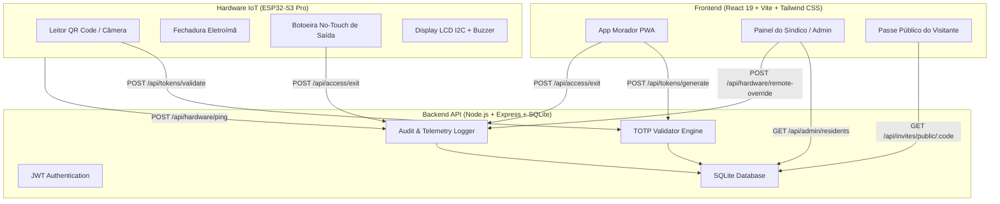

# Entrada InHouse • Controle de Acesso Autônomo para Mercados em Condomínios

<div align="center">


**Plataforma de alta segurança para controle de acesso físico, auditoria forense e emissão de chaves dinâmicas em minimercados autônomos 24/7 instalados em condomínios residenciais e comerciais.**

[Demonstração Rápida](#-inicialização-rápida-em-1-clique) • [Funcionalidades](#-principais-funcionalidades) • [Arquitetura](#-arquitetura-do-sistema) • [Hardware ESP32](#-hardware--firmware-esp32) • [Estrutura](#-estrutura-do-repositório)

</div>

---

## 📌 Visão Geral do Projeto

O **Entrada InHouse** é um ecossistema completo de engenharia de software e hardware IoT projetado para resolver os desafios críticos de segurança, controle de ocupação e conformidade legal em micromercados autônomos (*honest markets*).

A solução elimina a necessidade de portaria humana ou cartões físicos clonáveis, substituindo-os por **Chaves Dinâmicas TOTP** com ciclo de 30 segundos, **Passe Visitante com responsabilidade solidária** atrelada ao condômino e **Detecção Legal de Saída Livre (AVCB / NBR 9077)** com botoeira *No-Touch*.

---

## 🚀 Principais Funcionalidades

### 🛡️ Segurança e Controle de Acesso
- **Chaves Dinâmicas TOTP (30s):** Geração criptografada de QR Code efêmero com expiração rigorosa contra capturas de tela e gravação de vídeo (*Anti-Replay / Anti-Screenshot*).
- **Regra de Anti-Passback Estrita:** Impede que um morador empreste sua chave de entrada ou gere múltiplos acessos sem ter registrado a saída anterior.
- **Passes Visitante Auditáveis:** Moradores podem emitir convites temporários com duração configurável (2h, 4h, 12h, 24h) e controle de usos (*max uses*), gravando responsabilidade solidária automática no registro de auditoria.
- **Conformidade com a LGPD:** Bloqueio mandatório com termo de consentimento formal e política de privacidade antes de liberar a geração de credenciais.

### 🚪 Detecção e Registro Legal de Saída (AVCB & NBR 9077)
- **Princípio de Não-Retenção Física:** Atendimento irrestrito às normas do Corpo de Bombeiros, garantindo desobstrução imediata de rotas de fuga.
- **Múltiplos Métodos de Egress:** Suporte a Botoeira No-Touch por proximidade, comando digital pelo PWA do morador, totem de saída e liberação de emergência manual/remota.
- **Sincronização de Lotação em Tempo Real:** Atualização automática do medidor de ocupação atual da loja e liberação do Anti-Passback no instante da saída.

### 🖥️ Dashboard Administrativo Obsidian Glass (Estilo Apple)
- **KPIs em Tempo Real:** Contador de ocupação dinâmica com barra de capacidade máxima, fluxo diário de entradas, convites ativos e alertas de segurança.
- **Governança de Moradores e Unidades:** Painel completo de condôminos aprovados/pendentes, aceite LGPD e relação sanfonada (*accordion retrátil*) de todos os passes visitantes emitidos.
- **Privacidade de Infraestrutura:** Botão com ícone de olhinho (`Eye` / `EyeOff`) para ocultar/exibir o endereço IP do gateway de rede com persistência local.
- **Auditoria Forense (Apple Stream):** Registro cronológico auditável com filtros segmentados (*Todos*, *Moradores*, *Visitantes*, *Fluxo de Saída*, *Acessos Negados*) e exportação em CSV.

---

## 🏗️ Arquitetura do Sistema



---

## ⚡ Inicialização Rápida em 1 Clique

O repositório já inclui scripts executáveis para Windows que ligam todos os serviços automaticamente:

1. Dê um **duplo clique** no arquivo:
   👉 **`INICIAR_TUDO.bat`**
2. O script inicia o Backend (porta 3000), o Frontend com suporte à rede local Wi-Fi (porta 5173) e abre o navegador automaticamente em:
   - **Computador:** [http://localhost:5173](http://localhost:5173)
   - **Celular / Outros Dispositivos no Wi-Fi:** `http://<SEU_IP_LOCAL>:5173`
3. Para encerrar os serviços de forma limpa, dê um duplo clique em:
   👉 **`PARAR_TUDO.bat`**

### 💻 Inicialização Manual pelo Terminal

Caso prefira iniciar manualmente:

```bash
# 1. Iniciar o Backend
cd backend
npm install
node server.js

# 2. Em outro terminal, iniciar o Frontend
cd dashboard
npm install
npx vite --host
```

---

## 🔑 Credenciais Padrão de Demonstração

| Perfil | Usuário / Apto | Senha | Acesso |
| :--- | :--- | :--- | :--- |
| **Administrador (Síndico Geral)** | `Master` | `admin123` | Painel de monitoramento, governança de moradores e telemetria |
| **Morador (Unidade Autônoma)** | `101` | `101` | Chave dinâmica TOTP, emissão de convites e saída |
| **Morador de Testes** | `102` | `102` | Unidade adicional para simulação multi-morador |

---

## 🔌 Hardware & Firmware ESP32

O firmware de produção para microcontroladores ESP32 está localizado em [`hardware/esp32_firmware/esp32_firmware.ino`](file:///c:/Users/Jose%20Matheus/OneDrive/Documentos/Projeto%20da%20Visita%20T%C3%A9cnica/hardware/esp32_firmware/esp32_firmware.ino) e a bancada virtual de testes está configurada em [`hardware/wokwi_simulacao/diagram.json`](file:///c:/Users/Jose%20Matheus/OneDrive/Documentos/Projeto%20da%20Visita%20T%C3%A9cnica/hardware/wokwi_simulacao/diagram.json).

### Mapeamento de Pinos (Pinout)

| Componente | Pino ESP32 | Função |
| :--- | :--- | :--- |
| **Relé / Fechadura Eletroímã** | `GPIO 2` | Destravamento da porta (Fail-Safe) |
| **LED Vermelho (Acesso Negado)** | `GPIO 4` | Sinalização visual de bloqueio |
| **Buzzer Piezoelétrico** | `GPIO 15` | Feedback sonoro multitom |
| **Botão de Emergência / Pânico** | `GPIO 5` | Desbloqueio imediato com aviso sonoro |
| **Botoeira No-Touch de Saída** | `GPIO 18` | Sensor de saída livre por aproximação |
| **Display LCD 16x2 I2C** | `SDA (21) / SCL (22)` | Informações operacionais e mensagens |

---

## 📁 Estrutura do Repositório

```text
Projeto da Visita Técnica/
│
├── 🚀 INICIAR_TUDO.bat            # Atalho raiz: inicia Backend, Frontend e Browser
├── 🛑 PARAR_TUDO.bat              # Atalho raiz: encerra instâncias ativas do sistema
├── 🔄 SUBIR_PARA_GITHUB.bat       # Utilitário de sincronização contínua com o GitHub
├── 📄 README.md                   # Documentação técnica oficial da arquitetura
├── 📄 .gitignore                  # Regras de exclusão de artefatos e dependências
│
├── 📂 backend/                    # Servidor Node.js + Express + SQLite
│   ├── server.js                  # Rotas REST e controladores de telemetria
│   ├── database.js                # Schema e migrações do banco SQLite
│   └── 📂 tests/                  # Suíte de testes automatizados de integração
│       ├── test_exit_flow.js      # Validação do ciclo de saída e Anti-Passback
│       ├── test_admin_residents.js # Validação de gestão de moradores e convites
│       └── test_sprint1.js        # Testes de autenticação JWT e validação TOTP
│
├── 📂 dashboard/                  # PWA React 19 + Vite + Tailwind CSS
│   ├── src/
│   │   ├── pages/AdminDashboard.jsx   # Painel do Síndico (Estilo Apple / Obsidian Glass)
│   │   ├── pages/ResidentView.jsx     # PWA Mobile do Morador (TOTP + Saída)
│   │   ├── pages/GuestPass.jsx        # Tela pública do Passe Visitante
│   │   └── pages/Login.jsx            # Autenticação com perfis de demonstração
│   └── vite.config.js             # Configurações do Vite e plugins
│
├── 📂 hardware/                   # Soluções de Hardware e Internet das Coisas (IoT)
│   ├── 📂 esp32_firmware/         # Firmware C++ para o microcontrolador ESP32 físico
│   │   └── esp32_firmware.ino     # FSM, controle de relé, botoeira e telemetria HTTP
│   └── 📂 wokwi_simulacao/        # Bancada de simulação de circuito virtual
│       ├── diagram.json           # Diagrama esquemático de ligação dos componentes
│       ├── wokwi.ino              # Código de simulação no Wokwi
│       └── wokwi.toml             # Configuração de build do simulador
│
├── 📂 docs/                       # Base de Conhecimento e Governança
│   ├── 📂 manuais/                # Manuais de inicialização e rotinas operacionais
│   │   └── COMO_INICIAR_O_SISTEMA.md  # Guia passo a passo com fotos e FAQs
│   ├── 📂 historico_e_auditoria/  # Auditoria técnica e controle de versões
│   │   ├── HISTORICO_MUDANCAS.md  # Changelog cronológico detalhado (v1.0.0 a v2.0.0)
│   │   └── AUDITORIA_E_LOGS.md    # Especificações de logs forenses
│   └── 📂 design_stitch/          # Especificações visuais e telas Obsidian Glass
│
├── 📂 scripts/                    # Scripts de automação do ambiente
│   ├── iniciar_sistema.bat        # Inicializador avançado dos serviços
│   ├── iniciar_sistema.ps1        # Script moderno para PowerShell
│   └── parar_sistema.bat          # Finalizador limpo de processos Node/Vite
│
└── 📂 legacy_prototype/           # Protótipo estático original (Sprint 1)
    ├── index.html                 # Interface HTML legada
    ├── script.js                  # Lógica JavaScript legada
    └── style.css                  # Estilização CSS legada
```

---

## 📜 Licença e Responsabilidade

Desenvolvido para fins de pesquisa, visita técnica e implantação comercial de sistemas de controle de acesso autônomo para empreendimentos imobiliários e condomínios. Todos os direitos reservados.
